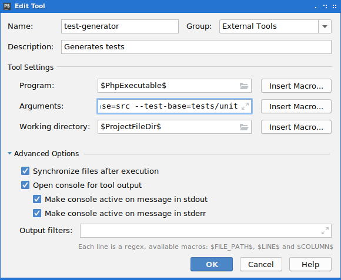

<p align="center">
  
</p>

[](https://travis-ci.org/mihaeu/php-test-generator)
[](https://codecov.io/gh/mihaeu/php-test-generator)


> Generate test cases for existing files

## Use Cases

 - PHPStorm has Apache Velocity support for file templates, but it is annoying to work with and limited
 - other IDEs or editors like Vim or Emacs don't have built-in code generation
 - somehow the test files never end up where they belong forcing you to rearrange code manually

`test-generator` saves you all the tedious work of typing repetitive code when testing legacy applications. Next time you write a test for a class with too many dependencies and you start mocking away think of how much time you could've saved if you could automate this.

This is where `test-generator` comes into play. Try it out, configure everything to your needs and create an alias for your shell or even better include it as an external tool in your editor/IDE ([like PHPStorm](https://www.jetbrains.com/help/phpstorm/external-tools.html)).

## Usage

### CLI

```bash
bin/test-generator --help
```

```
Test-Generator

Usage:
  test-generator [options] [(--src-base --test-base)] <file>

Options:
  --php5                        Generate PHP5 compatible code [default:false].
  --phpunit5                    Generate a test for PHPUnit 5 [default:false].
  --mockery                     Generates mocks using Mockery [default:false].
  --covers                      Adds the @covers annotation   [default:false].
  --base-class=<base-class>     Inherit from this base class e.g. "Example\TestCase".
  --subject-format=<format>     Format the field for the subject class.
  --field-format=<format>       Format the fields for dependencies.
  -s, --src-base=<path>         Base directory for source files; requires --test-base
  -t, --test-base=<path>        Base directory for test files; requires --src-base; writes output to that directory

Format:
  %n                            Name starting with a lower-case letter.
  %N                            Name starting with an upper-case letter.
  %t                            Type starting with a lower-case letter.
  %T                            Type starting with a upper-case letter.

Format Examples:
  "mock_%t"                      Customer => mock_customer
  "%NTest"                       arg => ArgTest
  "testClass"                    SomeName => TestClass
```

### PHPStorm

I recommend integrating `test-generator` as an external tool in PHPStorm. This works, because PHPStorm can pass the
filename of the currently active file as an argument to `test-generator`, which will then generate and write the
test to your preconfigured location. 

Navigate to Settings > Tools > External Tools and klick on **+**. Add the following information: 

| Field             | Value                                                                        |
|-------------------|------------------------------------------------------------------------------|
| Name              | test-generator                                                               |
| Description       | Generate Test Stubs                                                          |
| Program           | `$PhpExecutable`                                                             |
| Arguments         | `vendor/bin/test-generator $FilePath$ -s base=src -t tests/unit`             |
| Working directory | `$ProjectFileDir$`                                                           |

Remember to adjust *Program* and *Arguments* in case you are using the `.phar` file.

In case you want to generate different tests with different settings and locations, simply create more external tool entries.



**Pro Tip**: Assign a shortcut to this tool, because you might up ending it a lot ;)

## Installation

### Composer (PHP 7.1+)

```bash
# local install
composer require "mihaeu/test-generator:^1.0"

# global install
composer global require "mihaeu/test-generator:^1.0"
```

### Phar (PHP 5.5+)

Since I actually need to use this on 5.5 legacy projects (should work with 5.4 as well, but didn't test for it), I also release a phar file which works for older versions:

```bash
wget https://github.com/mihaeu/php-test-generator/releases/download/1.2.0/test-generator-1.2.0.phar
chmod +x test-generator-1.2.0.phar
```

**Please note that by doing this we should be disgusted at ourselves for not upgrading to PHP 7.1 (soon 7.2).**

### Git

```bash
git clone https://github.com/mihaeu/php-test-generator
cd php-test-generator
composer install
bin/test-generator --help
```

If you don't have PHP 7.1 installed you can run `bin/remove-php7-features` to convert the source files. I won't however except pull requests without PHP 7.1 support.

## Example

Given a PHP file like:

```php
<?php declare(strict_types=1);
namespace Mihaeu\TestGenerator;
use Twig_TemplateWrapper;
class TwigRenderer
{
    // ...
    public function __construct(\Twig_Environment $twig, TemplateConfiguration $templateConfiguration)
    {
        // ...
    }
    // ...
}
```

Running the following command:

```bash
# re-formatted for legibility
bin/test-generator src/TwigRenderer.php
    --field-format="mock%N" 
    --subject-format="classUnderTest" 
    --php5 
    --phpunit5 
    --mockery 
    --base-class="Vendor\\TestCase"
```
will produce a test including mocked dependencies:
```php
<?php

namespace Mihaeu\PhpDependencies\Analyser;

use Mockery;
use Mockery\MockInterface;
use Vendor\TestCase;

class StaticAnalyserTest extends TestCase
{
    /** @var StaticAnalyser */
    private $classUnderTest;

    /** @var PhpParser\NodeTraverser | MockInterface */
    private $mockNodeTraverser;

    /** @var Mihaeu\PhpDependencies\Analyser\DependencyInspectionVisitor | MockInterface */
    private $mockDependencyInspectionVisitor;

    /** @var Mihaeu\PhpDependencies\Analyser\Parser | MockInterface */
    private $mockParser;

    protected function setUp()
    {
        $this->mockNodeTraverser = Mockery::mock(PhpParser\NodeTraverser::class);
        $this->mockDependencyInspectionVisitor = Mockery::mock(Mihaeu\PhpDependencies\Analyser\DependencyInspectionVisitor::class);
        $this->mockParser = Mockery::mock(Mihaeu\PhpDependencies\Analyser\Parser::class);
        $this->classUnderTest = new StaticAnalyser(
            $this->mockNodeTraverser,
            $this->mockDependencyInspectionVisitor,
            $this->mockParser
        );
    }

    public function testMissing()
    {
        $this->fail('Test not yet implemented');
    }
}
```

## Roadmap

 - avoid FQNs by default by including (`use`) all required namespaces
 - `--template=<path>` for custom templates
 - and many more features are planned, just [check out the functional backlog](https://github.com/mihaeu/php-test-generator/tree/develop/tests/functional/backlog)

## Contributing

If you have any ideas for new features or are willing to contribute yourself you are more than welcome to do so.

Make sure to keep the code coverage at 100% (and run humbug for mutation testing) and stick to PSR-2. The `Makefile` in the repo is making lots of assumptions and probably won't work on your machine, but it might help.

## LICENSE

> Copyright (c) 2017-2018 Michael Haeuslmann
> 
> Permission is hereby granted, free of charge, to any person obtaining a copy
> of this software and associated documentation files (the "Software"), to deal
> in the Software without restriction, including without limitation the rights
> to use, copy, modify, merge, publish, distribute, sublicense, and/or sell
> copies of the Software, and to permit persons to whom the Software is
> furnished to do so, subject to the following conditions:
> 
> The above copyright notice and this permission notice shall be included in all
> copies or substantial portions of the Software.
> 
> THE SOFTWARE IS PROVIDED "AS IS", WITHOUT WARRANTY OF ANY KIND, EXPRESS OR
> IMPLIED, INCLUDING BUT NOT LIMITED TO THE WARRANTIES OF MERCHANTABILITY,
> FITNESS FOR A PARTICULAR PURPOSE AND NONINFRINGEMENT. IN NO EVENT SHALL THE
> AUTHORS OR COPYRIGHT HOLDERS BE LIABLE FOR ANY CLAIM, DAMAGES OR OTHER
> LIABILITY, WHETHER IN AN ACTION OF CONTRACT, TORT OR OTHERWISE, ARISING FROM,
> OUT OF OR IN CONNECTION WITH THE SOFTWARE OR THE USE OR OTHER DEALINGS IN THE
> SOFTWARE.
